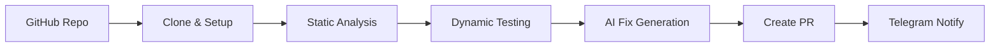

# 🔒 SmartAudit Agent

<div align="center">


**Production-Quality Autonomous Smart Contract Security Auditor**

An AI-powered security agent that autonomously audits smart contracts, performs static & dynamic analysis, and generates automated fixes with Pull Requests.

[Features](#-features) • [Quick Start](#-quick-start) • [Documentation](#-full-documentation) • [Demo](#-quick-demo) • [Docker](#-docker-deployment)

</div>

---

## ✨ Features

### 🤖 **Autonomous AI Agent**
- Built with [ADK-TS](https://github.com/iqai/adk-ts) (Agent Development Kit)
- Powered by **Gemini 2.5 Flash** for intelligent analysis
- Multi-step workflow: Plan → Execute → Monitor → Report
- Smart error handling and retry logic

### 🔍 **Comprehensive Security Analysis**

**Static Analysis:**
- 🐍 **Slither** - Python-based vulnerability scanner
- ✨ **Solhint** - Solidity linter
- � **Custom Patterns** - Reentrancy, access control, overflow checks
- 📊 Unified findings with severity scoring (Critical/High/Medium/Low)

**Dynamic Testing:**
- 🚀 Deploys contracts to **Arbitrum Sepolia** testnet
- 🔄 Executes live transactions
- ⛽ Monitors gas usage and transaction traces
- 🐛 Detects runtime vulnerabilities

### 🔧 **AI-Powered Fix Generation**
- Automated security patches using Gemini AI
- Confidence-based recommendations (High/Medium/Low)
- Code diffs and explanations
- One-click PR creation

### 📊 **Beautiful Web Dashboard**
- 🎨 Modern, responsive UI
- 📡 Real-time progress tracking
- 🌈 Color-coded severity indicators
- 📜 Live log streaming
- ⚡ One-click audit initiation

### 💬 **Telegram Integration**
- 🔔 Real-time audit notifications
- 📝 Top security findings alerts
- 🔗 PR creation updates
- 📊 Dynamic testing results

### 🔗 **GitHub Integration**
- 🤖 Automated Pull Request creation
- 📄 Detailed markdown security reports
- 💡 Code suggestions and fixes
- 🔍 Deployed contract links (Arbiscan)

---

## 🚀 Quick Start

### Prerequisites
- **Node.js** >= 22.0
- **pnpm** (or npm)
- **Git**
- **Python 3** + pip (optional, for Slither)

### Installation

```bash
# Clone the repository
git clone https://github.com/MrTimonM/smart-audit-agent.git
cd smart-audit-agent

# Install dependencies
pnpm install

# Configure environment
cp .env.example .env
# Edit .env with your API keys
```

### Configuration

Edit `.env` with your credentials:

```bash
# REQUIRED - Get from https://aistudio.google.com/app/apikey
GEMINI_API_KEY=your_gemini_api_key_here

# OPTIONAL (for full functionality)
GITHUB_TOKEN=your_github_token_here          # For creating PRs
TESTNET_PRIVATE_KEY=your_private_key_here    # For Arbitrum Sepolia
TELEGRAM_TOKEN=your_telegram_bot_token       # For notifications
TELEGRAM_CHAT_ID=your_chat_id               # Your Telegram chat ID

# RPC URLs (comma-separated, auto-selects best)
RPC_URLS=https://arbitrum-sepolia-rpc.publicnode.com,https://endpoints.omniatech.io/v1/arbitrum/sepolia/public
```

### Run the Server

```bash
# Development mode (with hot reload)
pnpm dev:server

# Production mode
pnpm build
pnpm start
```

### Access the Dashboard

Open your browser to: **http://localhost:3000**

---

## ⚡ Quick Demo

Run a mock audit without any real services:

```bash
pnpm demo:dry
```

Run a live audit (requires configuration):

```bash
pnpm demo:live
```

---

## 🐳 Docker Deployment

### Using Docker Compose (Recommended)

```bash
# 1. Configure environment
cp .env.example .env
# Edit .env with your values

# 2. Build and run
docker-compose up -d

# 3. View logs
docker-compose logs -f

# 4. Access at http://localhost:3000
```

### Using Docker

```bash
docker build -t smart-audit-agent .
docker run -p 3000:3000 --env-file .env smart-audit-agent
```

---

## 📖 Usage

### Web Interface

1. Navigate to `http://localhost:3000`
2. Enter a GitHub repository URL
   ```
   Example: https://github.com/OpenZeppelin/openzeppelin-contracts
   ```
3. Select branch (default: `main`)
4. Choose options:
   - ✅ Run Dynamic Tests on Arbitrum Sepolia
   - ✅ Create Pull Request with Fixes
5. Click **Start Audit**
6. Monitor real-time progress and view results

### REST API

**Start an Audit:**
```bash
curl -X POST http://localhost:3000/api/audit/start \
  -H "Content-Type: application/json" \
  -d '{
    "repoUrl": "https://github.com/owner/repo",
    "branch": "main",
    "runDynamicTests": true,
    "createPullRequest": true
  }'
```

**Get Audit Status:**
```bash
curl http://localhost:3000/api/audit/audit-1234567890
```

**List All Audits:**
```bash
curl http://localhost:3000/api/audits
```

---

## 🎯 What It Does



1. **📥 Clones** GitHub smart contract repositories
2. **🔍 Analyzes** with Slither, Solhint, and custom security patterns
3. **🚀 Deploys** contracts to Arbitrum Sepolia for live testing
4. **🤖 Generates** AI-powered security fixes using Gemini 2.5 Flash
5. **📝 Creates** detailed Pull Requests with findings and patches
6. **💬 Notifies** via Telegram with real-time audit updates

---

## 🛠️ Tech Stack

| Category | Technology |
|----------|-----------|
| **Framework** | [ADK-TS](https://github.com/iqai/adk-ts) (Agent Development Kit) |
| **AI Model** | Google Gemini 2.5 Flash |
| **Blockchain** | Arbitrum Sepolia Testnet |
| **Web Server** | Hono (Fast, lightweight) |
| **Static Analysis** | Slither, Solhint |
| **Language** | TypeScript 5.0+ |
| **Runtime** | Node.js 22+ |
| **Package Manager** | pnpm |
| **Notifications** | Telegram Bot API |
| **Version Control** | GitHub API (Octokit) |

---

## 📚 Full Documentation

See **[README-agent.md](./README-agent.md)** for comprehensive documentation:

- 📋 Detailed features and capabilities
- ⚙️ Installation and configuration guides
- 📖 Complete API reference
- 🐳 Docker deployment options
- 🧪 Demo scripts and examples
- 🏗️ Architecture and design patterns
- 🔒 Security best practices
- 🎓 ADK-TS integration patterns
- 🔧 Troubleshooting and FAQ

---

## 🔑 API Keys Setup

### Gemini API Key (Required)
1. Visit [Google AI Studio](https://aistudio.google.com/app/apikey)
2. Create a new API key
3. Add to `.env`: `GEMINI_API_KEY=your_key_here`

### GitHub Token (Optional)
See [GITHUB-TOKEN-SETUP.md](./GITHUB-TOKEN-SETUP.md) for detailed instructions.

### Telegram Bot (Optional)
See [TELEGRAM-SETUP.md](./TELEGRAM-SETUP.md) for setup guide.

---

## 📊 Project Structure

```
smart-audit-agent/
├── src/
│   ├── agent/              # Core agent logic
│   ├── actions/            # Audit actions (clone, analyze, test)
│   ├── telegram/           # Telegram bot integration
│   ├── utils/              # Helpers, config, logger
│   ├── demo/               # Demo scripts
│   ├── server.ts           # Web server
│   └── index.ts            # Entry point
├── public/                 # Web dashboard
├── docker-compose.yml      # Docker orchestration
├── Dockerfile              # Container definition
└── README.md              # This file
```

---

## 🤝 Contributing

Contributions are welcome! Please feel free to submit a Pull Request.

1. Fork the repository
2. Create your feature branch (`git checkout -b feature/AmazingFeature`)
3. Commit your changes (`git commit -m 'Add some AmazingFeature'`)
4. Push to the branch (`git push origin feature/AmazingFeature`)
5. Open a Pull Request

---

## 📄 License

This project is licensed under the MIT License - see the [LICENSE](LICENSE) file for details.

---

## 🙏 Acknowledgments

- Built with [ADK-TS](https://adk.iqai.com/) - Agent Development Kit for TypeScript
- Powered by [Google Gemini 2.5 Flash](https://deepmind.google/technologies/gemini/)
- Static analysis by [Slither](https://github.com/crytic/slither)
- Deployed on [Arbitrum Sepolia](https://sepolia.arbiscan.io/)

---

## 📞 Support

- 📖 [Full Documentation](./README-agent.md)
- 🐛 [Report Issues](https://github.com/MrTimonM/smart-audit-agent/issues)
- 💬 [Discussions](https://github.com/MrTimonM/smart-audit-agent/discussions)

---

<div align="center">

**Built with ❤️ using ADK-TS**

⭐ Star this repo if you find it useful!

</div>
